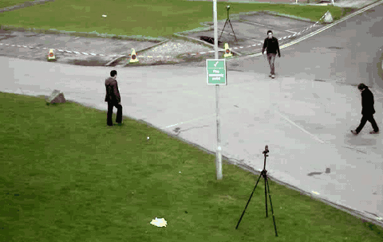

# Vision Memory

A local visual memory for video: it recognises objects it has seen before,
finds ones that look alike, and flags ones that do not belong.



*Each object is outlined, numbered, and keeps its number when it leaves the
frame and comes back. Everything below runs on a laptop CPU.*

All three come from a single idea. One frozen vision encoder turns every
tracked object into a vector, and each capability is a distance computation in
that one space:

| question | how it is answered |
| --- | --- |
| *Have I seen this before?* | nearest stored identity, above a calibrated boundary |
| *What looks like this?* | k-nearest neighbours over memory |
| *Is this normal?* | distance to the distribution of normal objects |
| *Where is the red backpack?* | the same, in a second space shared with text |

The encoder is never fine-tuned. A mutable encoder would invalidate every
vector already stored, so the backbone stays frozen and everything is built
around that constraint.

Runs entirely on a laptop CPU with integrated graphics. No GPU, no cloud, no
external services.

```
video -> detect -> track -> crop -> encode -> {memory, search, anomaly}
```

## Results

Scored against hand-labelled MOTChallenge identities, on a sequence used for
no tuning decision (MOT17-09):

| | IDF1 | identity switches |
| --- | --- | --- |
| tracker alone | 65.1% | 22 |
| **with re-identification** | **81.3%** | **9** |

IDF1 is the MOT benchmark's identity F1, computed by `motmetrics`. The tracker
row is the floor: what the numbers look like with re-identification switched
off. Every threshold in `configs/default.yaml` was chosen by running the whole
system end to end and reading these two columns, never by argument.

The same system measured as retrieval, which is how the re-identification
literature reports it — each observation queried against a gallery of all
others, with same-track matches excluded so neighbouring frames cannot answer
the query (`scripts/reid_retrieval.py`):

| | Rank-1 | Rank-5 | mAP | queries |
| --- | --- | --- | --- | --- |
| MOT17-09 (held out) | **93.6%** | 95.7% | **88.7%** | 672 |
| MOT17-02 (tuning) | 87.9% | 91.4% | 79.6% | 817 |

The two views answer different questions. Rank-1 judges the embedding alone,
with no tracker, threshold or binding logic involved; IDF1 judges the whole
system built on top of it. The gap between a 93.6% Rank-1 and an 81.3% IDF1 is
the cost of everything downstream of the features — and the reason the limits
below are stated in detector terms.

Honest limits, both measured rather than assumed:

- **The detector is the bottleneck, not the matching.** On MOT17-02 it finds
  69% of labelled people; the median labelled person is 39 px wide in a
  1920 px frame. Nobody can be re-identified who was never detected.
- **The scope is people.** On VisDrone drone footage the tracker reaches 31.0%
  IDF1 on vehicles and re-identification does not improve it. Cars viewed from
  above are close to identical, and the detector finds 26% of them. Objects are
  tracked and stored correctly; identifying *a particular car* is beyond these
  features.

## Model evaluations

Every model in this system was chosen by running the candidates and reading the
result, and several plausible ideas were built and then rejected on their own
numbers. The comparisons are worth as much as the choices.

**General backbone: Meta DINOv2 ViT-S/14 over NVIDIA C-RADIOv3-B.** Scored on
this project's own measures rather than published benchmarks: separation margin
0.848 against 0.849, retrieval 6 of 6 pairs for both, anomaly AUROC 0.991
against 0.991 across ten classes. Identical accuracy for 4.1x the latency
(491 against 119 ms/crop), 4.8x the memory (896 against 187 MB) and 6x the
vector width (2304 against 384 dims, which multiplies index memory and search
cost). No measured benefit to pay for. RADIO stays selectable with
`encoder.backend: radio`.

Two corrections to that evaluation, both found afterwards and both recorded:

- The bake-off ran RADIO at 256 px when its preferred resolution is 512, so it
  was measured at roughly a quarter of its intended cost and *still* only tied.
  The correction strengthens the conclusion rather than reversing it.
- The claim that RADIO's CLIP lineage made it the natural route to language
  search was wrong. All 17 variants in its `RESOURCE_MAP` carry `adaptor_names = None`:
  the adaptor types exist in the registry, but no shipped checkpoint has a text
  encoder. Language search needed a dedicated image-text model, which is why it
  runs on CLIP.

**Person appearance: Tencent YouTu over OSNet x0.25.** Offline the two look
close (held-out AUROC 0.992 against 0.981); end to end the gap is decisive.
Held out on a sequence used for no tuning decision:

| | IDF1 | switches |
| --- | --- | --- |
| tracker only | 65.1% | 22 |
| OSNet x0.25 | 66.6% | 19 |
| **YouTu** | **81.3%** | **9** |

The two score on different scales (calibrated boundary 0.593 against 0.755), so
the threshold is re-fitted from mined pairs after any swap rather than carried
over.

**Routing, because the specialist does not generalise.** A person re-id network
beats a general encoder on people (0.869 AUROC against 0.683) and collapses on
everything else, rating *unrelated* objects at 0.454 where DINOv2 gives 0.031.
Each object goes to the model that can see it, in disjoint slices of one vector.

**Language: CLIP ViT-B-32 over MobileCLIP2-S0.** The smaller model (75M
parameters against 151M) was the obvious pick for a CPU and ran at 112 ms/crop
against 44 ms, being designed for phone neural engines rather than desktop
PyTorch. Both retrieved correctly on 35x80 pixel crops.

### Built, measured, rejected

Kept in the log because the negative results carry the same information as the
positive ones:

| idea | why it should work | what it did |
| --- | --- | --- |
| Silhouette-masked crops | remove the background from the embedding | held-out AUROC 0.979 to 0.962; the embedder is trained on rectangles |
| Temporal voting on rebinds | confirm before committing, as OCR pipelines do | switches 9 to 35; a deferred track wears no number while a rival takes it |
| Minimum confidence to create | stop static objects becoming people | rejected three ways; distant real people are also detected weakly |
| Fine-tuning the detector on the target domain | the detector is the measured ceiling and its weights are stock COCO | five cameras lift its own recall 0.826 to 0.859 and mAP50 0.840 to 0.917, while held-out IDF1 falls 81.3% to 67.4% |


## The parts trained here

The vision backbones are frozen and pretrained; three pieces are fitted from
this project's own data, all of them on human labels rather than on the
system's own output.

**The decision boundary.** Not a hand-set number: it is fitted from mined pairs
so that a stated false-merge rate is held, and re-fitted whenever the embedder
changes, because each model scores on its own scale (0.593 for the shipped
person embedder, 0.755 for the previous one). Two separate boundaries are
calibrated, for two genuinely different questions — comparing two crops, and
comparing a live track against a stored record that maximises over several
saved views. The second sits higher by construction, and using one number for
both merged different people.

**A pair verifier** (`scripts/reid_train.py`, `MlpVerifier`) — one hidden layer
of 128 over `[a*b, |a-b|, cos]`, trained in torch offline and run in numpy at
inference so nothing new is needed to deploy it. Positives are the same
annotated person at least 30 frames apart, since the returning person is the
case that matters; negatives are weighted toward the hardest pairs, where
cosine actually fails. Judged on a held-out sequence it scored 0.978 against
plain cosine's 0.980. **Cosine ships.** An earlier version of this trained on
pairs mined from the tracker's own output — circular ground truth — and that is
exactly the mistake the labelled evaluation exists to prevent.

**A projection head** (`scripts/reid_project.py`, `ProjectedEmbedder`) — a
768→128 linear map trained with supervised contrastive loss, PCA-initialised,
each batch holding several people with several views each, pulling a view
toward its own person and pushing it from everyone else's, hardest negatives
first. It held its separation on unseen returns at a sixth of the size, but
cost about two points of end-to-end IDF1. Kept as a config option, off by
default, for when memory and search cost matter more than accuracy.

Two of the three lost to a simple baseline, and that is the result. The
pipelines are in the repository because the way a thing was trained and judged
is what makes the answer trustworthy — and because a trained model that beats
nothing is worth exactly as much as knowing it beats nothing.

### What actually moved the numbers

The largest single gain in this project came from **choosing** rather than
training. Swapping the person embedder from OSNet x0.25 to Tencent YouTu is a
one-line configuration change, and held out it was worth **+14.7 IDF1 and half
the identity switches** — more than every training experiment here put
together. Second was **routing**: sending people to a person specialist and
everything else to a general encoder, because measurement showed each model
collapses on the other's subject. Third was **calibration**: fitting the
decision boundaries from labelled pairs instead of setting them by hand, worth
77.5% accuracy against 68.8% on held-out tracks.

None of those are models we trained. All of them are decisions we measured.

### The detector, and the limit of the method

The detector is the system's ceiling — nobody can be re-identified who was
never detected — and it ships with stock COCO weights while this footage is
small, distant, overhead pedestrians. That mismatch made fine-tuning the one
remaining lever with measured headroom, so it was tried properly, twice.

    held out, MOT17-09         recall   mAP50    IDF1    IDsw
      stock COCO                0.826   0.840   81.3%       9
      fine-tuned, 1 camera      0.818   0.887   67.8%      37
      fine-tuned, 5 cameras     0.859   0.917   67.4%      41

The first attempt failed in a way that was easy to explain: 600 frames of a
single fixed camera taught the model that scene rather than pedestrians, it
became more conservative, and it made 31% fewer detections. Fewer detections
means gaps in tracks, fragmentation rose 44 to 71, and every restart is a new
identity. Precision, mAP and MOTA all improved while the thing that matters
collapsed — a good illustration of why this project scores itself end to end
rather than on the detector's own metrics.

The second attempt fixed what the first one taught: five cameras instead of
one, mosaic augmentation off, and checkpoint selection on recall rather than
mAP. The detector genuinely improved — recall 0.826 to 0.859, the first time
that number moved the right way — and the system still got worse.

**That result is recorded as unresolved, because it is.** The five-camera model
matches the stock one on every detector measure available here: recall 93.8%
against 94.1%, detections 2,103 against 2,128, box overlap with ground truth
0.828 against 0.817 (better), frame-to-frame stability 0.783 against 0.785,
detection gaps 21 against 21, false positives 30.1% against 30.8%. Yet the
tracker alone fragments twice as often and loses seven IDF1 points before
re-identification is involved at all, and re-sweeping the re-id boundary does
not recover it.

The likeliest explanation, and it is a hypothesis rather than a finding: every
tracker threshold here — `max_age`, `iou_threshold`, `appearance_veto`,
`measurement_noise`, `high_conf` — was chosen against the stock detector's
output. The system is co-adapted to its detector in the same way the re-id
boundary is co-adapted to its embedder, which this project already knows must
be re-fitted after a swap. If that is right, replacing the detector means
re-tuning the tracker, and a component swapped in isolation will lose however
good it is on its own.

Stock weights ship. What the two attempts bought is a closed question and a
measured shape for the next one: more cameras, then re-tune what sits on top,
and judge it on recall and identity rather than on the metric that flatters.


## Live

```bash
python scripts/live_demo.py --source 0        # webcam, or a video file path
```

Three modes, switched with `1` `2` `3`, all of them at camera rate:

1. **Memory** — every object outlined and numbered, keeping its number when it
   leaves and returns.
2. **Search** — click an object; the closest matches in memory are ranked.
3. **Anomaly** — objects shaded by how unusual they are, with a heatmap showing
   *where* on the object is unusual rather than only how much.
4. **Language** — press `/` and type a description; the objects in memory that
   match it are highlighted. "a person in a red jacket" finds the person in the
   red jacket, and "a bicycle" correctly finds nothing when there is no bicycle.

Detection, embedding, segmentation and heatmaps each run on their own thread,
and the display projects boxes forward with optical flow between pipeline
passes, so the picture stays smooth while a pass takes about a second.

## Setup

```bash
python -m venv .venv && .venv\Scripts\activate     # source .venv/bin/activate
pip install -r requirements.txt
pytest
```

Model files are not in the repository (they are large, and several carry their
own licences). `data/models/` needs:

| file | what it is | where from |
| --- | --- | --- |
| `yolo11n_768.onnx` | detector | export YOLO11n from `ultralytics` at `imgsz=768` |
| `yolo11n_seg_768.onnx` | display silhouettes | same, from `yolo11n-seg` |
| `person_reid_youtu_2021nov.onnx` | person appearance | OpenCV Zoo |

DINOv2 ViT-S/14, the general-object encoder, is fetched by `torch.hub` on first
use. `ultralytics` is only ever used to produce the ONNX files once, in a
throwaway environment; the project itself never imports it and runs the
detector through `onnxruntime` with its own decoding and NMS.

## Layout

```
src/vision_memory/     one module per pipeline stage
  encoder.py           frozen DINOv2, global and per-patch descriptors
  appearance.py        routes people to a specialist embedder, objects to DINOv2
  detector.py          YOLO11 ONNX: letterbox, decode, NMS, all in numpy
  segmenter.py         instance masks, for the display only
  tracker.py           ByteTrack-style: Kalman, two-pass association, lifecycle
  memory.py            SQLite identities joined to a FAISS exemplar index
  reid.py              pair mining and learned verification boundaries
  reidentifier.py      binding a track to a stored identity, and unbinding it
  search.py            the FAISS index
  anomaly.py           kNN / Mahalanobis / IsolationForest / OC-SVM
  heatmap.py           per-patch anomaly, so it can say where
  language.py          a CLIP space shared with text, for search by description
  engine.py            one pipeline, three reads
scripts/               entrypoints: demos, benchmarks, evaluation, calibration
tests/                 pytest
configs/default.yaml   every tunable, with the measurement behind it
```

## Notes on some choices

- **Language search gets its own space, deliberately.** The identity vectors
  are trained so two people in similar coats land apart; text search needs the
  opposite, since "a red backpack" must match every red backpack. One space
  cannot do both, so CLIP vectors live in a second index keyed by identity and
  nothing about the identity path changes.
- **The detector is the bottleneck, and the evaluation says so.** Re-identifying
  someone who was never detected is impossible, so effort spent on matching has
  a ceiling set by recall. That is why the limits above are stated in detector
  terms rather than as a re-identification score.
- **Held out means held out.** One sequence is used for tuning and another is
  never consulted while choosing anything. Every headline number in this file
  is from the second.

## Licence

MIT. Model weights are covered by their own licences.
